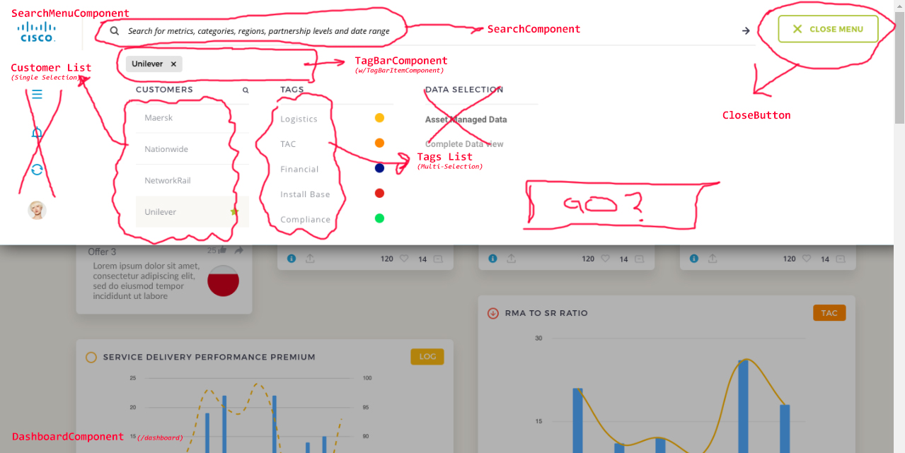

# Components

These make up all of the "black-box" functionality in the app. Components contain
other components. The top level directories under this directory represent
components that represent router outlets (i.e. the pages).  

## Component Etiquette
If you add a component, be sure to enter a heading and a good description of your
component below. This is not a technical design document, just an easy to understand
reference as to what the components are.

## Abstract Components
These are shared abstracts that can be extended (TypeScript inheritance)

## Routed Components
These are the top level `pages` that handle a route behavior.

### `DashboardComponent`
This component displays the charts and data, provides a search interface
and allows the user to filter the data, and show subsets.

### `LoginComponent`
Collects user credentials and sends them to the auth service for validation and then
redirects to the DashboardComponent route.

### `SignUpComponent`
Collects user information and allows them to create an account in the local Database.

## UI
These components represent individual widgets, or groups of widgets, forms, or
other items that are required to carry out the operations provided when on a specific
page (or on any page for global interactions)

### The Search Menu

#### `search-menu` Component
This is the Floating Dropdown Menu which provides the search tools, and provides
the selection to the application, which then uses this data to filter the overall
selected data into a concise dataset. This dataset will be displayed in the Dashboard

#### `tagbar` Component
This component maintains a list of `tagbar-item` components. the tagbar items
represent the filter selection from the search-menu component

#### `tagbar-item` Component
A tag bar item represents a filter selection, and is displayed in the tagbar

#### `search` Component
A Search bar component (Think Google). NOTE: This may not do anything at first!

#### `List` Single or Multi-Select
Allows a list of choices to be displayed and selected.
  - tags
  - customers
