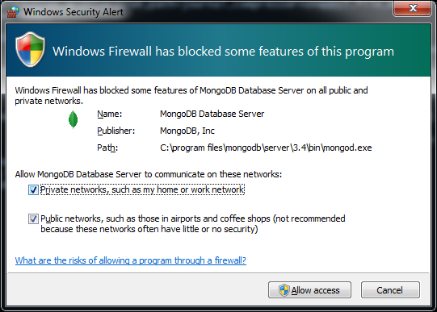

# Services

## AuthenticationService
This service handles signup, login, forgotten passwords, etc.

### Deployment for Authentication
#### For Local Deployment
Insure you've installed mongodb and Node.js
1. Windows
   1. visit https://docs.mongodb.com/manual/tutorial/install-mongodb-on-windows/#get-mongodb-community-edition
   2. follow instructions to install mongo.
   3. follow instructions to configure mongo environment (local)
   4. First run: Allow access
       
   5. Run `npm start run:win` to start the windows build
2. Mac
   1.
#### Requirements
1.
2.

#### Steps

1.
2.
